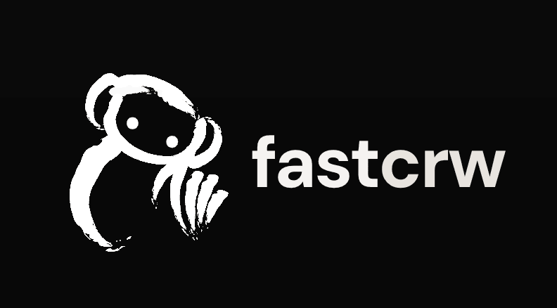

<a name="readme-top"></a>
<p align="center">
  <a href="https://fastcrw.com">
    
  </a>
  <p align="center">The web scraper built for AI agents. Single binary. Zero config.</p>
  <p align="center">
    <a href="https://crates.io/crates/crw-server"></a>
    <a href="https://github.com/us/crw/actions"></a>
    <a href="LICENSE"></a>
    <a href="https://github.com/us/crw/stargazers"></a>
    <a href="https://fastcrw.com"></a>
  </p>
  <p align="center">
    <a href="https://twitter.com/fastcrw">
      
    </a>
    <a href="https://www.linkedin.com/company/fastcrw">
      
    </a>
    <a href="https://discord.gg/kkFh2SC8">
      
    </a>
  </p>
  <p align="center">
    <a href="https://www.producthunt.com/products/fastcrw?utm_source=badge-featured&utm_medium=badge&utm_campaign=badge-fastcrw" target="_blank" rel="noopener noreferrer"></a>
  </p>
  <p align="center">
    Works with: Claude Code · Cursor · Windsurf · Cline · Copilot · Continue.dev · Codex · Gemini CLI
  </p>
  <p align="center">
    <a href="#quick-start">Quick Start</a> &bull;
    <a href="#connect-to-ai-agents--mcp-skill-onboarding">AI Agents</a> &bull;
    <a href="#benchmark">Benchmarks</a> &bull;
    <a href="https://docs.fastcrw.com/#rest-api">API Reference</a> &bull;
    <a href="https://fastcrw.com">Cloud</a> &bull;
    <a href="https://discord.gg/kkFh2SC8">Discord</a>
  </p>
  <p align="center">
    <b>English</b> | <a href="README.zh-CN.md">中文</a>
  </p>
</p>

---

# fastCRW — Open Source Web Scraping API for AI Agents

**Power AI agents with clean web data.** Single Rust binary, zero config, Firecrawl-compatible API. The open-source Firecrawl alternative you can self-host for free — or use our [managed cloud](https://fastcrw.com).

> **Don't want to self-host?** [**Sign up free →**](https://fastcrw.com) — managed cloud with global proxy network, web search, and dashboard. Same API, zero infra. **500 free credits, no credit card required.**

<a href="https://github.com/us/crw">
  
</a>

---

## Why CRW? — Firecrawl & Crawl4AI Alternative

- **Single binary, 6 MB RAM** — no Redis, no Node.js, no containers. Firecrawl needs 5 containers and 4 GB+. Crawl4AI requires Python + Playwright
- **5.5x faster than Firecrawl** — 833ms avg vs 4,600ms ([see benchmarks](#benchmark)). P50 at 446ms
- **73/100 search win rate** — beats Firecrawl (25/100) and Tavily (2/100) in head-to-head benchmarks
- **Free self-hosting** — $0/1K scrapes vs Firecrawl's $0.83–5.33. No infra, no cold starts (85ms). No API key required for local mode
- **Agent ready** — add to any MCP client in one command. Embedded mode: no server needed
- **Firecrawl-compatible API** — drop-in replacement. Same `/v1/scrape`, `/v1/crawl`, `/v1/map` endpoints. HTML to markdown, structured data extraction, website crawler — all built-in
- **Built for RAG pipelines** — clean LLM-ready markdown output for vector databases and AI data ingestion
- **Open source** — AGPL-3.0, developed transparently. [Join our community](https://discord.gg/kkFh2SC8)

---

## Web Scraping & Crawling Features

**Core**

| Feature | Description |
|---------|-------------|
| [**Scrape**](#scrape) | Convert any URL to markdown, HTML, JSON, or links |
| [**Crawl**](#crawl) | Async BFS website crawler with rate limiting |
| [**Map**](#map) | Discover all URLs on a site instantly |
| [**Search**](#search) | Web search + content scraping (cloud) |

**More**

| Feature | Description |
|---------|-------------|
| [**LLM Extraction**](#llm-structured-extraction) | Send a JSON schema, get validated structured data back |
| [**JS Rendering**](#js-rendering) | Auto-detect SPAs, render via LightPanda or Chrome |
| [**CLI**](#cli) | Scrape any URL from your terminal — no server needed |
| [**MCP Server**](#mcp-server-for-ai-agents) | Built-in stdio + HTTP transport for any AI agent |

**Use Cases:** RAG pipelines · AI agent web access · content monitoring · data extraction · HTML to markdown conversion · web archiving

---

## Quick Start

```bash
# Install:
curl -fsSL https://raw.githubusercontent.com/us/crw/main/install.sh | CRW_BINARY=crw sh

# Scrape:
crw example.com

# Add to Claude Code (local):
claude mcp add crw -- npx crw-mcp
# Add to Claude Code (cloud — includes web search, 500 free credits at fastcrw.com):
claude mcp add -e CRW_API_URL=https://fastcrw.com/api -e CRW_API_KEY=your-key crw -- npx crw-mcp
```

> Or: `pip install crw` (Python SDK) · `npx crw-mcp` (zero install) · `brew install us/crw/crw` (Homebrew) · [All install options →](https://docs.fastcrw.com/installation/)

### Scrape

Convert any URL to clean markdown, HTML, or structured JSON.

```python
from crw import CrwClient

client = CrwClient(api_url="https://fastcrw.com/api", api_key="YOUR_API_KEY")  # local: CrwClient()
result = client.scrape("https://example.com")
print(result["markdown"])
```

> **Local mode:** `CrwClient()` with no arguments runs a self-contained scraping engine — no server, no API key, no setup. The SDK automatically downloads the `crw-mcp` binary on first use.

<details>
<summary><b>CLI / cURL</b></summary>

**CLI:**
```bash
crw example.com
crw example.com --format html
crw example.com --js --css 'article'
```

**Self-hosted** (`crw-server` running on `:3000`):
```bash
curl -X POST http://localhost:3000/v1/scrape \
  -H "Content-Type: application/json" \
  -d '{"url": "https://example.com"}'
```

**Cloud:**
```bash
curl -X POST https://fastcrw.com/api/v1/scrape \
  -H "Authorization: Bearer YOUR_API_KEY" \
  -H "Content-Type: application/json" \
  -d '{"url": "https://example.com"}'
```
</details>

Output:
```
# Example Domain

This domain is for use in illustrative examples in documents.
You may use this domain in literature without prior coordination.
```

### Crawl

Scrape all pages of a website asynchronously.

```python
from crw import CrwClient

client = CrwClient(api_url="https://fastcrw.com/api", api_key="YOUR_API_KEY")  # local: CrwClient()
pages = client.crawl("https://docs.example.com", max_depth=2, max_pages=50)
for page in pages:
    print(page["metadata"]["sourceURL"], page["markdown"][:80])
```

<details>
<summary><b>CLI / cURL</b></summary>

```bash
# Start crawl
curl -X POST http://localhost:3000/v1/crawl \
  -H "Content-Type: application/json" \
  -d '{"url": "https://docs.example.com", "maxDepth": 2, "maxPages": 50}'

# Check status (use job ID from above)
curl http://localhost:3000/v1/crawl/JOB_ID
```
</details>

### Map

Discover all URLs on a site instantly.

```python
from crw import CrwClient

client = CrwClient(api_url="https://fastcrw.com/api", api_key="YOUR_API_KEY")  # local: CrwClient()
urls = client.map("https://example.com")
print(urls)  # ["https://example.com", "https://example.com/about", ...]
```

<details>
<summary><b>cURL</b></summary>

```bash
curl -X POST http://localhost:3000/v1/map \
  -H "Content-Type: application/json" \
  -d '{"url": "https://example.com"}'
```
</details>

### Search

Search the web and get full page content from results.

```python
from crw import CrwClient

# Cloud only — requires fastcrw.com API key
client = CrwClient(api_url="https://fastcrw.com/api", api_key="YOUR_KEY")
results = client.search("open source web scraper 2026", limit=10)
```

> **Cloud only:** `search()` requires a [fastcrw.com](https://fastcrw.com) API key (**500 free credits, no credit card**). Local/embedded mode provides `scrape`, `crawl`, and `map`.

<details>
<summary><b>cURL</b></summary>

```bash
curl -X POST https://fastcrw.com/api/v1/search \
  -H "Authorization: Bearer YOUR_API_KEY" \
  -H "Content-Type: application/json" \
  -d '{"query": "open source web scraper 2026", "limit": 10}'
```
</details>

### API Endpoints

| Method | Endpoint | Description |
|--------|----------|-------------|
| `POST` | `/v1/scrape` | Scrape a single URL, optionally with LLM extraction |
| `POST` | `/v1/crawl` | Start async BFS crawl (returns job ID) |
| `GET` | `/v1/crawl/:id` | Check crawl status and retrieve results |
| `DELETE` | `/v1/crawl/:id` | Cancel a running crawl job |
| `POST` | `/v1/map` | Discover all URLs on a site |
| `POST` | `/v1/search` | Web search with optional content scraping (cloud only) |
| `GET` | `/health` | Health check (no auth required) |
| `POST` | `/mcp` | Streamable HTTP MCP transport |

[Full API reference →](https://docs.fastcrw.com/#rest-api)

---

## Connect to AI Agents — MCP, Skill, Onboarding

Add CRW to any AI agent or MCP client in seconds.

### Skill

Install the CRW skill to all detected agents with one command:

```bash
npx crw-mcp init --all
```

Restart your agent after installing. Works with Claude Code, Cursor, Gemini CLI, Codex, OpenCode, and Windsurf.

### MCP Server for AI Agents

Add CRW to any MCP-compatible client:

```json
{
  "mcpServers": {
    "crw": {
      "command": "npx",
      "args": ["crw-mcp"]
    }
  }
}
```

> Works with Claude Desktop, Cursor, Windsurf, Cline, Continue.dev, and any MCP client.
>
> **Config file locations:** Claude Code — `claude mcp add` (no file edit). Claude Desktop — `~/Library/Application Support/Claude/claude_desktop_config.json`. Cursor — `.cursor/mcp.json`. Windsurf — `~/.codeium/windsurf/mcp_config.json`. [All clients →](https://docs.fastcrw.com/mcp-clients/)

**Cloud mode** — adds `crw_search` for web search:

```json
{
  "mcpServers": {
    "crw": {
      "command": "npx",
      "args": ["crw-mcp"],
      "env": {
        "CRW_API_URL": "https://fastcrw.com/api",
        "CRW_API_KEY": "your-api-key"
      }
    }
  }
}
```

### MCP Tools

| Mode | Tool | Description |
|------|------|-------------|
| **Embedded + Cloud** | `crw_scrape` | Scrape a URL → markdown, HTML, JSON, links |
| **Embedded + Cloud** | `crw_crawl` | Start async BFS crawl (returns job ID) |
| **Embedded + Cloud** | `crw_check_crawl_status` | Poll crawl job status (use with `crw_crawl`) |
| **Embedded + Cloud** | `crw_map` | Discover all URLs on a site |
| **Cloud only** | `crw_search` | Web search + optional content scraping |

> **Embedded mode** (default): no server, no API key, no setup — the MCP binary runs a self-contained scraping engine. **Cloud mode** (`CRW_API_URL` set): forwards calls to [fastcrw.com](https://fastcrw.com), adds `crw_search`.

[Full MCP docs →](https://docs.fastcrw.com/mcp/)

**Claude Code shortcut:**

```bash
# Local (embedded — no server, no API key):
claude mcp add crw -- npx crw-mcp

# Cloud (+ web search):
claude mcp add -e CRW_API_URL=https://fastcrw.com/api -e CRW_API_KEY=your-key crw -- npx crw-mcp
```

> Listed on the [MCP Registry](https://registry.modelcontextprotocol.io/?q=crw)

### Agent Onboarding

Are you an AI agent? Fetch this skill file to configure CRW for the user's coding agents. The SKILL.md contains tool descriptions, usage examples, authentication setup, and edge case handling:

```bash
curl -s https://fastcrw.com/agent-onboarding/SKILL.md
```

---

## Benchmark

### Search — CRW vs Firecrawl vs Tavily (100 queries, concurrent)

| Metric | CRW | Firecrawl | Tavily |
|---|---|---|---|
| **Avg Latency** | **880ms** | 954ms | 2,000ms |
| **Median Latency** | **785ms** | 932ms | 1,724ms |
| **Win Rate** | **73/100** | 25/100 | 2/100 |

CRW is **2.3x faster than Tavily** and won 73% of latency races. [Full search benchmark →](https://fastcrw.com/benchmarks/tavily-search)

### Scrape — CRW vs Firecrawl (1,000 URLs, JS rendering enabled)

Tested on [Firecrawl's scrape-content-dataset-v1](https://huggingface.co/datasets/firecrawl/scrape-content-dataset-v1):

| Metric | CRW | Firecrawl v2.5 |
|---|---|---|
| **Coverage** | **92.0%** | 77.2% |
| **Avg Latency** | **833ms** | 4,600ms |
| **P50 Latency** | **446ms** | — |
| **Noise Rejection** | **88.4%** | noise 6.8% |
| **Idle RAM** | **6.6 MB** | ~500 MB+ |
| **Cost / 1K scrapes** | **$0** (self-hosted) | $0.83–5.33 |

<details>
<summary><b>Resource comparison</b></summary>

| Metric | CRW | Firecrawl |
|---|---|---|
| Min RAM | ~7 MB | 4 GB |
| Recommended RAM | ~64 MB (under load) | 8–16 GB |
| Docker images | single ~8 MB binary | ~2–3 GB total |
| Cold start | 85 ms | 30–60 seconds |
| Containers needed | 1 (+optional sidecar) | 5 |

</details>

[Full benchmark details →](https://docs.fastcrw.com/introduction/#benchmarks)

Run the benchmark yourself:

```bash
pip install datasets aiohttp
python bench/run_bench.py
```

---

## Install

### MCP Server (`crw-mcp`) — recommended for AI agents

```bash
npx crw-mcp                           # zero install (npm)
pip install crw                        # Python SDK (auto-downloads binary)
brew install us/crw/crw-mcp            # Homebrew
cargo install crw-mcp                  # Cargo
docker run -i ghcr.io/us/crw crw-mcp  # Docker
```

### CLI (`crw`) — scrape URLs from your terminal

```bash
brew install us/crw/crw

# One-line install (auto-detects OS & arch):
curl -fsSL https://raw.githubusercontent.com/us/crw/main/install.sh | CRW_BINARY=crw sh

# APT (Debian/Ubuntu):
curl -fsSL https://apt.fastcrw.com/gpg.key | sudo gpg --dearmor -o /usr/share/keyrings/crw.gpg
echo "deb [signed-by=/usr/share/keyrings/crw.gpg] https://apt.fastcrw.com stable main" | sudo tee /etc/apt/sources.list.d/crw.list
sudo apt update && sudo apt install crw

cargo install crw-cli
```

### API Server (`crw-server`) — Firecrawl-compatible REST API

For serving multiple apps, other languages (Node.js, Go, Java), or as a shared microservice.

```bash
brew install us/crw/crw-server

# One-line install:
curl -fsSL https://raw.githubusercontent.com/us/crw/main/install.sh | CRW_BINARY=crw-server sh

# Docker:
docker run -p 3000:3000 ghcr.io/us/crw
```

Custom port:
```bash
CRW_SERVER__PORT=8080 crw-server                                       # env var
docker run -p 8080:8080 -e CRW_SERVER__PORT=8080 ghcr.io/us/crw       # Docker
```

> **When do you need `crw-server`?** Only if you want a REST API endpoint. The Python SDK (`CrwClient()`) and MCP binary (`crw-mcp`) both run a self-contained engine — no server required.

---

## SDKs

### Python

```bash
pip install crw
```

```python
from crw import CrwClient

# Cloud (fastcrw.com — includes web search):
client = CrwClient(api_url="https://fastcrw.com/api", api_key="YOUR_API_KEY")
# Local (embedded, no server needed):
# client = CrwClient()

# Scrape
result = client.scrape("https://example.com", formats=["markdown", "links"])
print(result["markdown"])

# Crawl (blocks until complete)
pages = client.crawl("https://docs.example.com", max_depth=2, max_pages=50)

# Map
urls = client.map("https://example.com")

# Search (cloud only)
results = client.search("AI news", limit=10, sources=["web", "news"])
```

> **Requires:** Python 3.9+. Local mode auto-downloads the `crw-mcp` binary on first use — no manual setup.

### Community SDKs

- [`crewai-crw`](https://pypi.org/project/crewai-crw/) — CRW scraping tools for CrewAI agents
- [`langchain-crw`](https://pypi.org/project/langchain-crw/) — CRW document loader for LangChain

> **Node.js:** No official SDK yet — use the REST API directly or `npx crw-mcp` for MCP. [SDK examples →](https://docs.fastcrw.com/sdk-examples/)

---

## Integrations

**Frameworks:** [CrewAI](https://pypi.org/project/crewai-crw/) · [LangChain](https://pypi.org/project/langchain-crw/) · [Agno](https://github.com/agno-agi/agno/pull/7183) · [Dify](https://github.com/langgenius/dify)

**Platforms:** [n8n](https://fastcrw.com/blog/n8n-web-scraping-crw) · [Flowise](https://github.com/FlowiseAI/Flowise/pull/6066)

Missing your favorite tool? [Open an issue →](https://github.com/us/crw/issues) · [All integrations →](https://docs.fastcrw.com/integrations/)

---

## LLM Structured Extraction

Send a JSON schema, get validated structured data back using LLM function calling. [Full extraction docs →](https://docs.fastcrw.com/extract/)

```bash
curl -X POST http://localhost:3000/v1/scrape \
  -H "Content-Type: application/json" \
  -d '{
    "url": "https://example.com/product",
    "formats": ["json"],
    "jsonSchema": {
      "type": "object",
      "properties": {
        "name": { "type": "string" },
        "price": { "type": "number" }
      },
      "required": ["name", "price"]
    }
  }'
```

Configure the LLM provider:

```toml
[extraction.llm]
provider = "anthropic"        # "anthropic" or "openai"
api_key = "sk-..."            # or CRW_EXTRACTION__LLM__API_KEY env var
model = "claude-sonnet-4-20250514"
```

---

## JS Rendering

CRW auto-detects SPAs and renders them via a headless browser. [Full JS rendering docs →](https://docs.fastcrw.com/js-rendering/)

```bash
crw-server setup   # downloads LightPanda, creates config.local.toml
```

| Renderer | Protocol | Best for |
|----------|----------|----------|
| LightPanda | CDP over WebSocket | Low-resource environments (default) |
| Chrome | CDP over WebSocket | Existing Chrome infrastructure |
| Playwright | CDP over WebSocket | Full browser compatibility |

With Docker Compose, LightPanda runs as a sidecar automatically:

```bash
docker compose up
```

---

## CLI

Scrape any URL from your terminal — no server, no config. [Full CLI docs →](https://docs.fastcrw.com/quick-start/)

```bash
crw example.com                        # markdown to stdout
crw example.com --format html          # HTML output
crw example.com --format links         # extract all links
crw example.com --js                   # with JS rendering
crw example.com --css 'article'        # CSS selector
crw example.com --stealth              # stealth mode (rotate UAs)
crw example.com -o page.md             # write to file
```

---

## Self-Hosting

Once [installed](#api-server-crw-server--firecrawl-compatible-rest-api), start the server and optionally enable JS rendering:

```bash
crw-server                    # start REST API on :3000
crw-server setup              # optional: downloads LightPanda for JS rendering
docker compose up             # alternative: Docker with LightPanda sidecar
```

See the [self-hosting guide](https://docs.fastcrw.com/#self-hosting) for production hardening, auth, reverse proxy, and resource tuning.

---

## Open Source vs Cloud

| | Self-hosted (free) | [fastcrw.com](https://fastcrw.com) Cloud |
|---|---|---|
| Core scraping | ✅ | ✅ |
| JS rendering | ✅ (LightPanda/Chrome) | ✅ |
| Web search | ❌ | ✅ |
| Global proxy network | ❌ | ✅ |
| Dashboard | ❌ | ✅ |
| Commercial use without open-sourcing | Requires AGPL compliance | ✅ Included |
| Cost | $0 | From $13/mo |

> [**Sign up free →**](https://fastcrw.com) — **500 free credits**, no credit card required.

---

## Architecture

```
┌─────────────────────────────────────────────┐
│                 crw-server                  │
│         Axum HTTP API + Auth + MCP          │
├──────────┬──────────┬───────────────────────┤
│ crw-crawl│crw-extract│    crw-renderer      │
│ BFS crawl│ HTML→MD   │  HTTP + CDP(WS)      │
│ robots   │ LLM/JSON  │  LightPanda/Chrome   │
│ sitemap  │ clean/read│  auto-detect SPA     │
├──────────┴──────────┴───────────────────────┤
│                 crw-core                    │
│        Types, Config, Errors                │
└─────────────────────────────────────────────┘
```

| Crate | Description | |
|-------|-------------|-|
| [`crw-core`](crates/crw-core) | Core types, config, and error handling | [](https://crates.io/crates/crw-core) |
| [`crw-renderer`](crates/crw-renderer) | HTTP + CDP browser rendering engine | [](https://crates.io/crates/crw-renderer) |
| [`crw-extract`](crates/crw-extract) | HTML → markdown/plaintext extraction | [](https://crates.io/crates/crw-extract) |
| [`crw-crawl`](crates/crw-crawl) | Async BFS crawler with robots.txt & sitemap | [](https://crates.io/crates/crw-crawl) |
| [`crw-server`](crates/crw-server) | Axum API server (Firecrawl-compatible) | [](https://crates.io/crates/crw-server) |
| [`crw-mcp`](crates/crw-mcp) | MCP stdio server (embedded + proxy mode) | [](https://crates.io/crates/crw-mcp) |
| [`crw-cli`](crates/crw-cli) | Standalone CLI (`crw` binary, no server) | [](https://crates.io/crates/crw-cli) |

[Full architecture docs →](https://docs.fastcrw.com/architecture/)

---

## Configuration

Layered TOML config with environment variable overrides:

1. `config.default.toml` — built-in defaults
2. `config.local.toml` — local overrides (or `CRW_CONFIG=myconfig`)
3. Environment variables — `CRW_` prefix, `__` separator (e.g. `CRW_SERVER__PORT=8080`)

```toml
[server]
host = "0.0.0.0"
port = 3000
rate_limit_rps = 10

[renderer]
mode = "auto"  # auto | lightpanda | playwright | chrome | none

[crawler]
max_concurrency = 10
requests_per_second = 10.0
respect_robots_txt = true

[auth]
# api_keys = ["fc-key-1234"]
```

See [full configuration reference](https://docs.fastcrw.com/#configuration).

---

## Security

- **SSRF protection** — blocks loopback, private IPs, cloud metadata (`169.254.x.x`), IPv6 mapped addresses, and non-HTTP schemes (`file://`, `data:`)
- **Auth** — optional Bearer token with constant-time comparison
- **robots.txt** — RFC 9309 compliant with wildcard patterns
- **Rate limiting** — token-bucket algorithm, returns 429 with `error_code`
- **Resource limits** — max body 1 MB, max crawl depth 10, max pages 1000

[Full security docs →](https://docs.fastcrw.com/self-hosting-hardening/)

---

## Resources

- [Documentation](https://docs.fastcrw.com)
- [API Reference](https://docs.fastcrw.com/#rest-api)
- [MCP Setup Guide](https://docs.fastcrw.com/#mcp)
- [Playground](https://docs.fastcrw.com/playground/)
- [Changelog](CHANGELOG.md)

---

## Contributing

Contributions are welcome! Please open an issue or submit a pull request.

1. Fork the repository
2. Install pre-commit hooks: `make hooks`
3. Create your feature branch (`git checkout -b feat/my-feature`)
4. Commit your changes (`git commit -m 'feat: add my feature'`)
5. Push to the branch (`git push origin feat/my-feature`)
6. Open a Pull Request

The pre-commit hook runs the same checks as CI (`cargo fmt`, `cargo clippy`, `cargo test`). Run manually with `make check`.

### Contributors

<a href="https://github.com/us/crw/graphs/contributors">
  
</a>

---

## License

CRW is open-source under [AGPL-3.0](LICENSE). For a managed version without AGPL obligations, see [fastcrw.com](https://fastcrw.com).

---

## Get Started

- **Self-host free:** `curl -fsSL https://raw.githubusercontent.com/us/crw/main/install.sh | sh` — works in 30 seconds
- **Cloud:** [**Sign up free →**](https://fastcrw.com) — **500 free credits**, no credit card required
- **Questions?** [Join our Discord](https://discord.gg/kkFh2SC8)

---

**It is the sole responsibility of end users to respect websites' policies when scraping.** Users are advised to adhere to applicable privacy policies and terms of use. By default, CRW respects `robots.txt` directives.

<p align="right">
  <a href="#readme-top">↑ Back to Top ↑</a>
</p>
