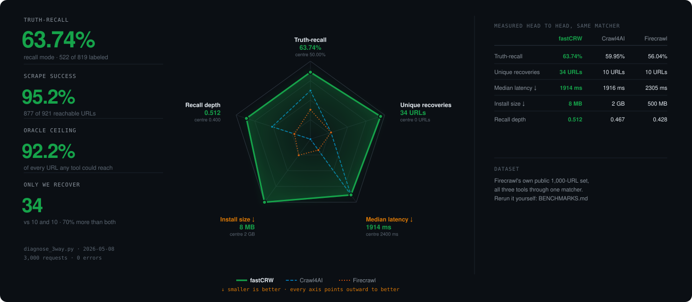

<p align="center">
  
</p>

<h1 align="center">fastCRW</h1>

<p align="center">
  Turn URLs into clean <strong>markdown</strong> or structured
  <strong>JSON</strong> with one engine for search, scrape, map, crawl, and extract.
</p>

<p align="center">
  Run it locally as a small Rust binary or use the managed API.
</p>

<p align="center">
  <a href="https://fastcrw.com/register"><strong>Get 1000 free credits →</strong></a> ·
  <a href="#one-command-install"><strong>Install</strong></a> ·
  <a href="https://docs.fastcrw.com"><strong>Docs</strong></a>
</p>

<p align="center">
  <sub>No credit card. Continue with GitHub.</sub>
</p>

<p align="center">
  <a href="https://crates.io/crates/crw-server"></a>
  <a href="https://pypi.org/project/crw/"></a>
  <a href="https://www.npmjs.com/package/crw-mcp"></a>
  <a href="https://github.com/us/crw/actions/workflows/ci.yml"></a>
  <a href="LICENSE"></a>
  <a href="https://github.com/us/crw/stargazers"></a>
</p>

## One-command install

```bash
curl -fsSL https://fastcrw.com/install | sh
```

Runs local and free, no account needed. To use the Cloud, paste your key into
the same command and it installs the binary, connects the key, and registers the
MCP server with the AI coding tools you already have:

```bash
curl -fsSL https://fastcrw.com/install | CRW_API_KEY=crw_live_... sh
```

```bash
crw search "rust tutorials"
```

Claude Code, Cursor, Codex, Gemini CLI, OpenCode and Windsurf are picked up
automatically when they are already set up; nothing else is touched, and your
key stays in `~/.config/crw/config.toml` rather than being copied into each
tool. Add `CRW_NO_AGENTS=1` to skip that step, or run `crw setup` on its own to
choose interactively.

**1000 free credits, no credit card.** Managed proxies, JS rendering and search,
with nothing to run or keep up to date.
[Get my free key →](https://fastcrw.com/register)

macOS and Linux, Intel and ARM.
[More install options →](https://docs.fastcrw.com/installation/)

## What it does

| Operation | Outcome |
|---|---|
| **Scrape** | One URL to markdown, HTML, links, screenshots, or schema JSON |
| **Crawl** | Follow a bounded site crawl and collect its pages |
| **Map** | Discover URLs without scraping every page |
| **Search** | Search the web and optionally scrape selected results |
| **Extract** | Produce structured fields from one or many URLs |

[See the full API →](https://docs.fastcrw.com/#rest-api)

## Why fastCRW

On Firecrawl's own public 1,000-URL dataset, fastCRW recovered more truth than
Crawl4AI and Firecrawl, matched the fastest median latency, and idled at
**~14 MB RAM**.

<p align="center">
  <a href="BENCHMARKS.md">
    
  </a>
</p>

<p align="center"><sub><a href="BENCHMARKS.md">Methodology, full numbers, and how to reproduce it</a></sub></p>

## Choose how you use it

### CLI

```bash
crw https://example.com            # scrape, works right after install
crw search "rust async runtime"    # search, after `crw setup`
```

### Python SDK

Using Cloud? [Get an API key](https://fastcrw.com/register), then export it once:

```bash
export CRW_API_KEY="crw_live_..."
pip install crw
```

```python
from crw import CrwClient

client = CrwClient()
page = client.scrape("https://example.com", formats=["markdown"])

print(page["markdown"])
```

<details>
<summary><strong>Node.js</strong></summary>

```bash
npm install crw-sdk
```

```javascript
import { CrwClient } from "crw-sdk";

const client = new CrwClient();

const page = await client.scrape("https://example.com", {
  formats: ["markdown"],
});

console.log(page.markdown);
```

</details>

[Local mode and more SDK examples →](https://docs.fastcrw.com/sdk-examples/) ·
[REST API →](https://docs.fastcrw.com/#rest-api)

### MCP for AI agents

```bash
npx -y crw-mcp@latest install
```

Installs the CRW skill and MCP server in your detected AI tools. `crw setup` can
also do this step, so either path is enough.
[Manual setup →](https://docs.fastcrw.com/mcp-clients/)

## Choose where it runs

| | Managed API | Local / self-hosted |
|---|---|---|
| Best for | Zero infrastructure and managed scaling | Data control, private networks, or custom infrastructure |
| Start | [Create an API key](https://fastcrw.com/register), then `crw setup` | Install and run `crw <URL>` |
| Operations | Managed proxies, billing, and hosted capabilities | You choose renderers, search, auth, proxies, and capacity |

Capabilities and response shapes can differ by deployment:
[`/v1/capabilities`](https://docs.fastcrw.com/capabilities/) · [response shapes](https://docs.fastcrw.com/response-shapes/)

[Self-hosting guide →](https://docs.fastcrw.com/self-hosting/)

## Learn more

- [Quickstart](https://docs.fastcrw.com/quick-start/)
- [API reference](https://docs.fastcrw.com/#rest-api)
- [Benchmarks](BENCHMARKS.md)
- [Firecrawl migration](https://docs.fastcrw.com/migrate-from-firecrawl/)
- [Self-hosting](https://docs.fastcrw.com/self-hosting/)

## Contributing

The workspace requires Rust 1.85 or newer:

```bash
git clone https://github.com/us/crw
cd crw
make check-fast
```

[Read the contributor guide →](CONTRIBUTING.md)

Engine and MCP server: [AGPL-3.0](LICENSE). Python and TypeScript SDKs: MIT.
Embedding license: hello@fastcrw.com.

## Star History

<a href="https://www.star-history.com/?repos=us%2Fcrw&type=date&legend=top-left">
 <picture>
   <source media="(prefers-color-scheme: dark)" srcset="https://api.star-history.com/chart?repos=us/crw&type=date&theme=dark&legend=top-left&sealed_token=Pe6pRWL7lqTM-St9eo-Cmpk5kYNyuyun0krw9eVZQFIrm3g_R2h46IW6wfNalPXquMsWSNCgKqiar1YVo9MGy2IZmN5Lz6rjZcjBCw6bCcRHORKORFRi9A" />
   <source media="(prefers-color-scheme: light)" srcset="https://api.star-history.com/chart?repos=us/crw&type=date&legend=top-left&sealed_token=Pe6pRWL7lqTM-St9eo-Cmpk5kYNyuyun0krw9eVZQFIrm3g_R2h46IW6wfNalPXquMsWSNCgKqiar1YVo9MGy2IZmN5Lz6rjZcjBCw6bCcRHORKORFRi9A" />
   
 </picture>
</a>

<details>
<summary>Contributors</summary>

<!-- contributors:start -->
<p align="center">
  <a href="https://github.com/us" title="us"></a>
  <a href="https://github.com/santhreal" title="santhreal"></a>
  <a href="https://github.com/AsheTheWings" title="AsheTheWings"></a>
  <a href="https://github.com/adambenhassen" title="adambenhassen"></a>
  <a href="https://github.com/paoloantinori" title="paoloantinori"></a>
  <a href="https://github.com/mj520" title="mj520"></a>
</p>
<!-- contributors:end -->

</details>

<sub>Please respect website policies. Crawl and map follow `robots.txt` by default.</sub>
